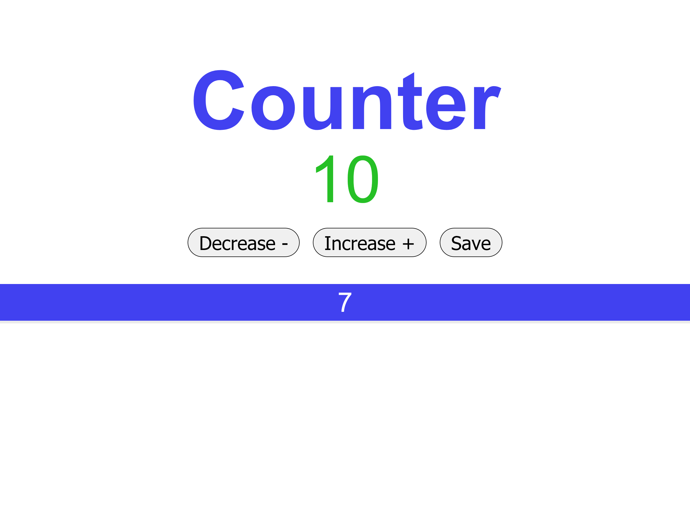

# js-counter
JS Challenge 5

Exercise 5 from the 100+ Javascript projects page (https://jsbeginners.com/javascript-projects-for-beginners/)

Increases/Decreases the number when pressing the matching button, and allows to save the current number aswell.

